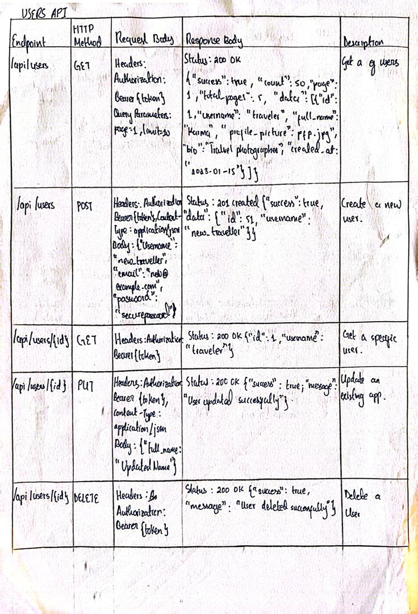
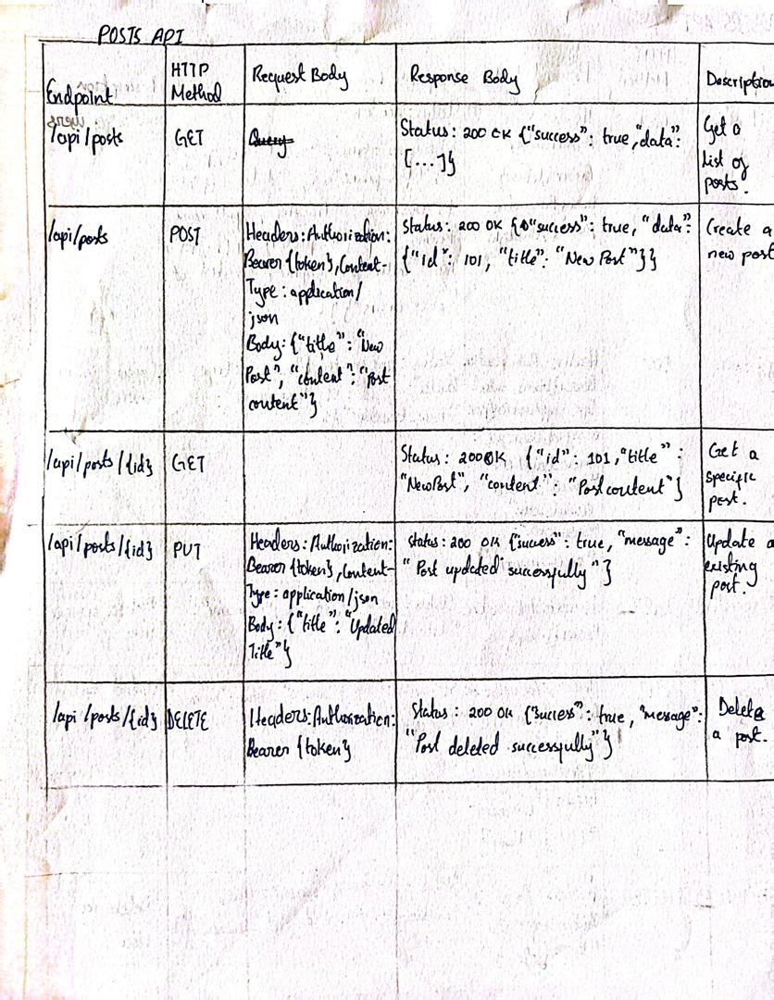
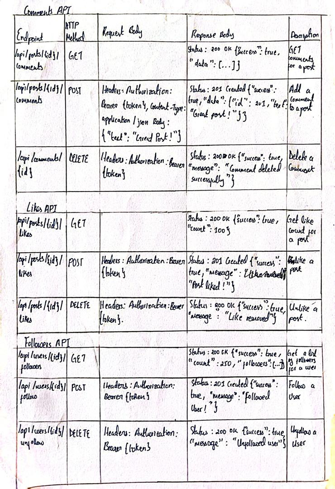

# Social Media API

## Objectives
1. Design RESTful API endpoints following best practices for URI design.
2. Implement API endpoints with proper HTTP methods and status codes.
3. Configure content negotiation with different MIME types.
4. Set up proper request and response handling.
5. Document your API endpoints.

## Instructions
1. Clone the repository:
   ```bash
   git clone <repository-url>
   cd social-media-api
   ```

2. Install dependencies:
   ```bash
   npm install
   ```

3. Start the server:
   - For production:
     ```bash
     npm start
     ```
   - For development (with hot reload):
     ```bash
     npm run dev
     ```

4. Access the API at `http://localhost:3000`.

## Solutions
### Example Endpoints
- **Users**: `/api/users` (GET, POST, PUT, DELETE)
- **Posts**: `/api/posts` (GET, POST, PUT, DELETE)
- **Comments**: `/api/posts/:postId/comments` (GET, POST, DELETE)
- **Likes**: `/api/posts/:postId/likes` (POST, DELETE)
- **Followers**: `/api/users/:userId/followers` (GET, POST, DELETE)

### Images


