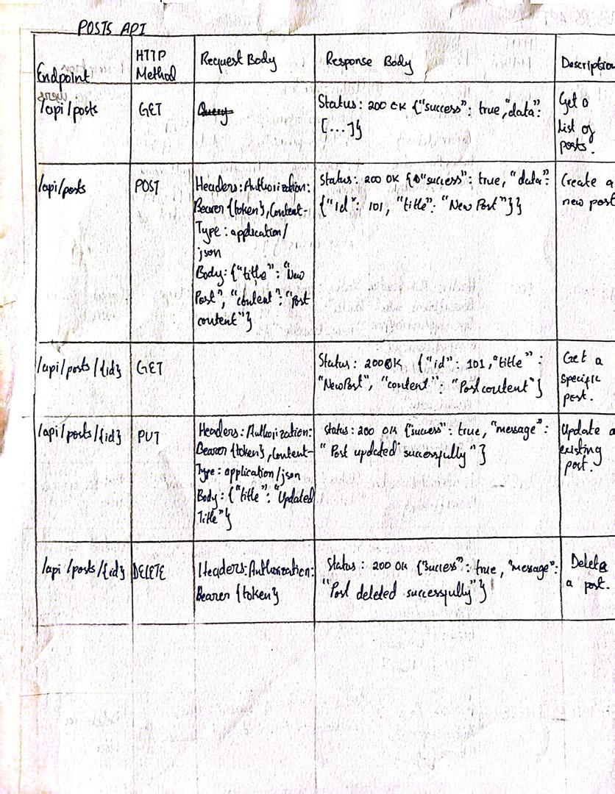
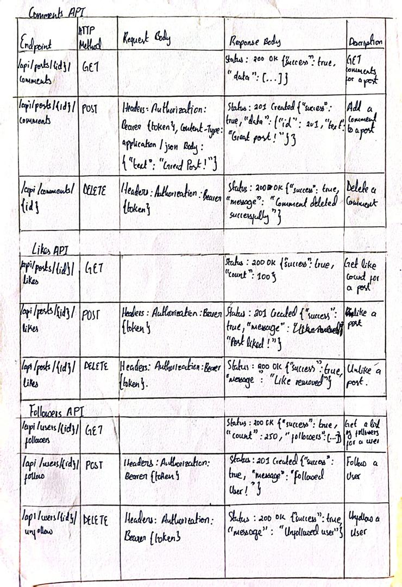

# Reflection: RESTful API Design for Social Media Platform

## 1. Documentation

In this practical, I designed and structured a RESTful API for a social media platform. The API follows best practices, including:

- Clear and consistent resource-based URIs.
- Proper HTTP methods (GET, POST, PUT, DELETE) for different operations.
- Secure authentication using JWT tokens.
- Standardized response formats for consistency and ease of integration.

### Main API Components

- **Users:** Registration, retrieval, updating, and deletion.
- **Posts:** CRUD operations for user-generated content.
- **Comments:** Adding and managing post discussions.
- **Likes:** Tracking engagement on posts.
- **Followers:** Managing user relationships.

## 2. Reflection

### What I Learned

This practical helped me understand:
- The importance of endpoint structuring to ensure scalability and maintainability.
- The role of authentication and how it protects user data.
- How to standardize API responses to enhance usability.
- The significance of error handling to provide clear feedback to clients.

### Challenges Faced and Solutions

| Challenge                                         | Solution                                          |
|--------------------------------------------------|--------------------------------------------------|
| Structuring endpoints while maintaining simplicity | Followed RESTful principles and ensured logical grouping. |
| Managing authentication for protected endpoints   | Implemented JWT-based authentication.            |
| Ensuring meaningful error handling                | Used proper status codes and structured error messages. |

### Screenshots
#### Error Handling Example

#### Authentication Flow

## 3. Conclusion

This practical enhanced my understanding of RESTful API design and its application in real-world scenarios. Future improvements could include real-time notifications, media uploads, and enhanced security mechanisms.
